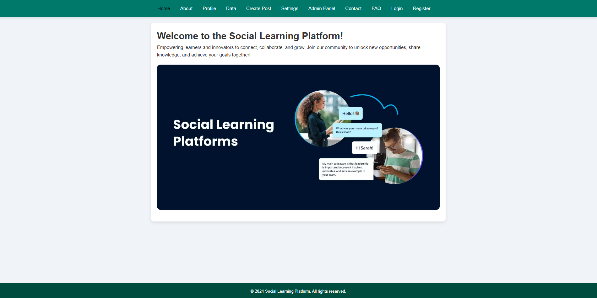
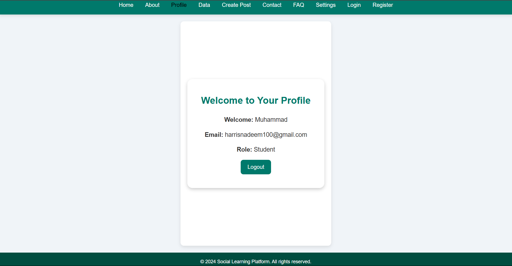
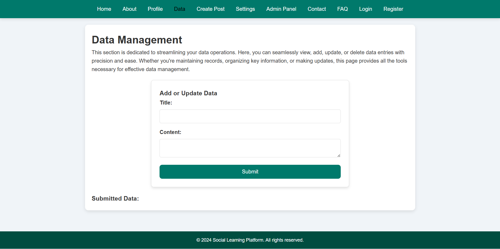
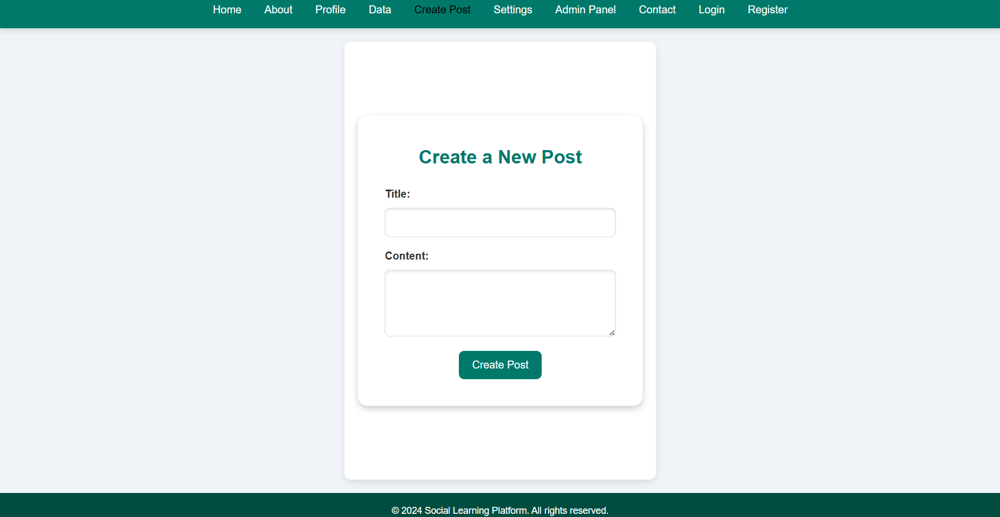
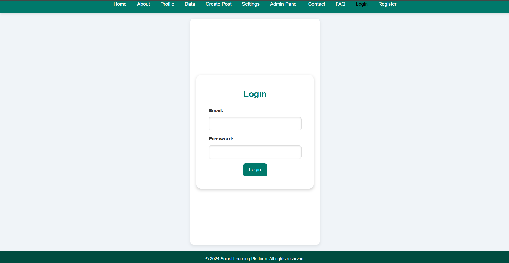
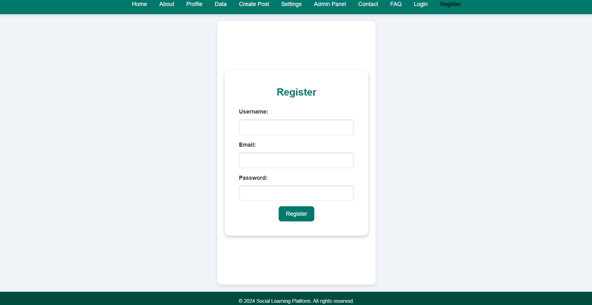
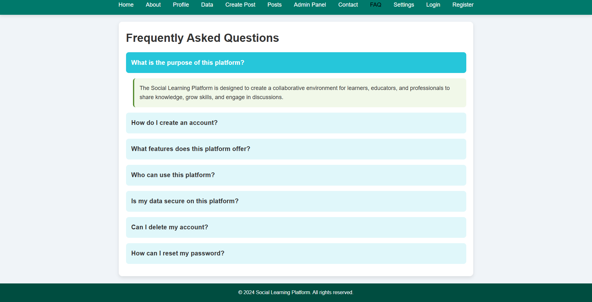
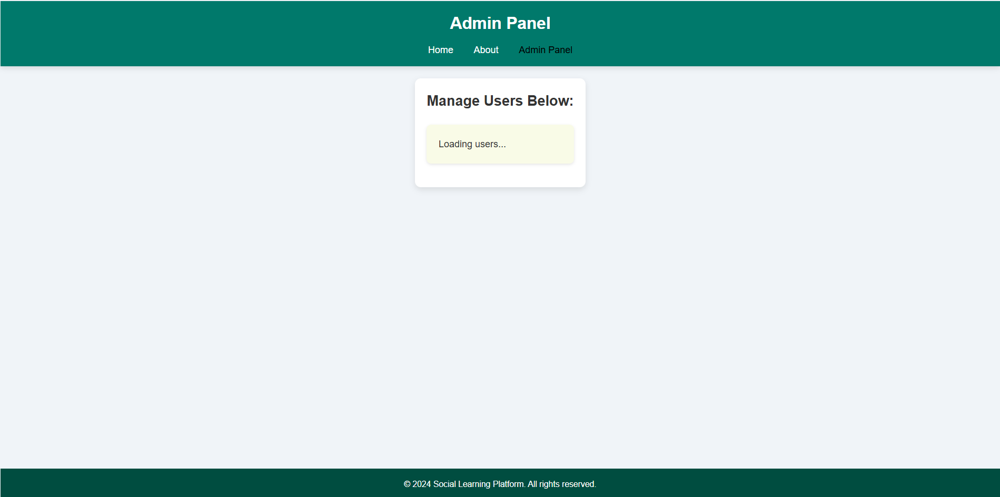

# 📚 Social Learning Platform

A collaborative platform empowering learners, innovators, and educators to connect, share knowledge, and grow together. Built with a focus on simplicity, accessibility, and meaningful engagement.

🔗 **Live Repository**: [Social Learning Platform](https://github.com/Harris1250/social-learning-platform)  
🔗 **LinkedIn**: [Muhammad Nadeem](https://www.linkedin.com/in/muhammad-nadeem-977683251/)

---

## 💡 What This Project Does

- Enables users to register, log in, and manage profiles
- Create, read, update, and delete posts
- View platform-wide learning data and analytics
- Navigate an admin panel to manage roles & permissions
- Promotes a safe, community-based learning environment

---

## 🧠 Tools & Tech Stack

| Category       | Tools/Technologies         |
|----------------|-----------------------------|
| Frontend       | HTML, CSS                  |
| Backend Logic  | JavaScript (static client logic) |
| Pages          | Multiple HTML pages with navigation |
| Dev Tools      | VS Code, Git, GitHub        |
| Hosting        | Static page local run (open `index.html`) |

---

## 📸 Screenshots

### 🔹 Homepage  

### 🔹 About Page  
### 🔹 About Page  

### 🔹 Profile Page  

### 🔹 Data Management  

### 🔹 Create Post  

### 🔹 Contact Page  

### 🔹 Login Page  

### 🔹 Register Page  

### 🔹 FAQ Page  

### 🔹 Admin Panel  

---

## ⚙️ How to Run This Project

No server or build tools needed. Just open it up:

1. git clone https://github.com/Harris1250/social-learning-platform.git
cd social-learning-platform

2. Then simply open `index.html` in your browser.

---

## 📬 Contact

Let’s connect:  
📧 Email: harris.nadm@gmail.com  
🔗 LinkedIn: [Muhammad Nadeem](https://www.linkedin.com/in/muhammad-nadeem-977683251/)

---

✨ _Built with purpose. Styled for clarity. Empowering learners one page at a time._
